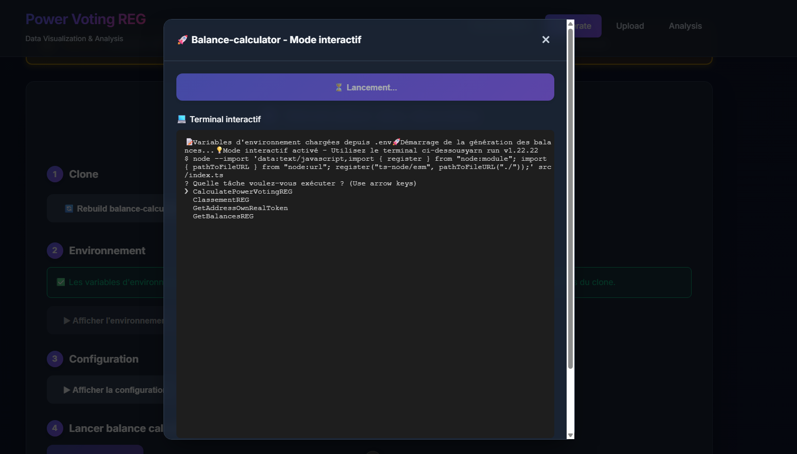
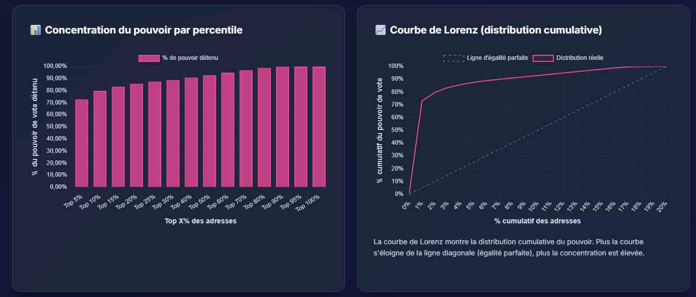
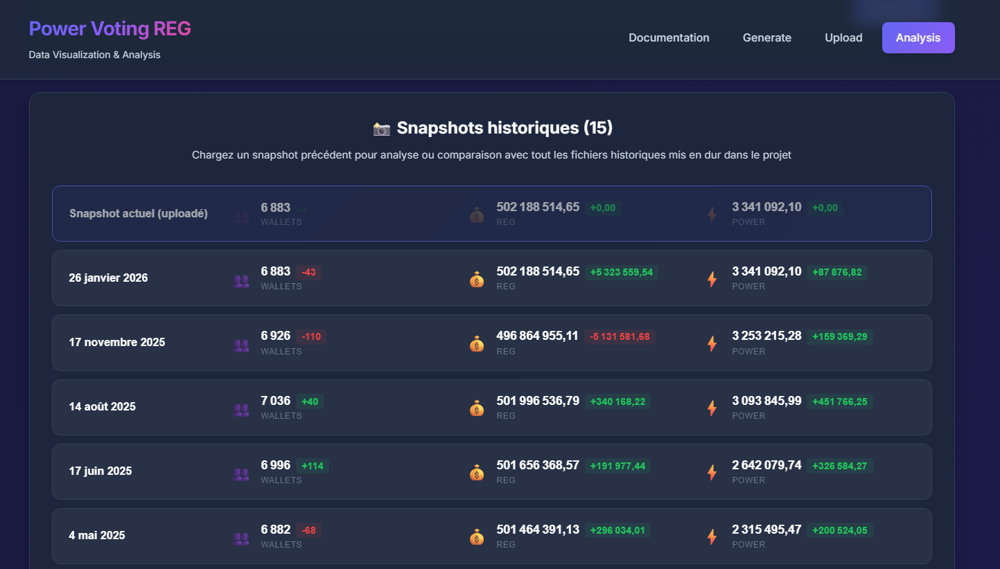
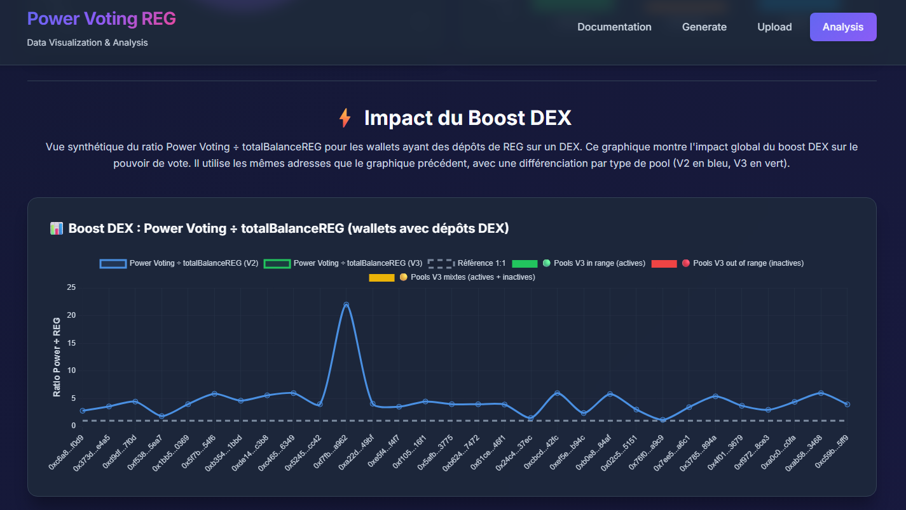
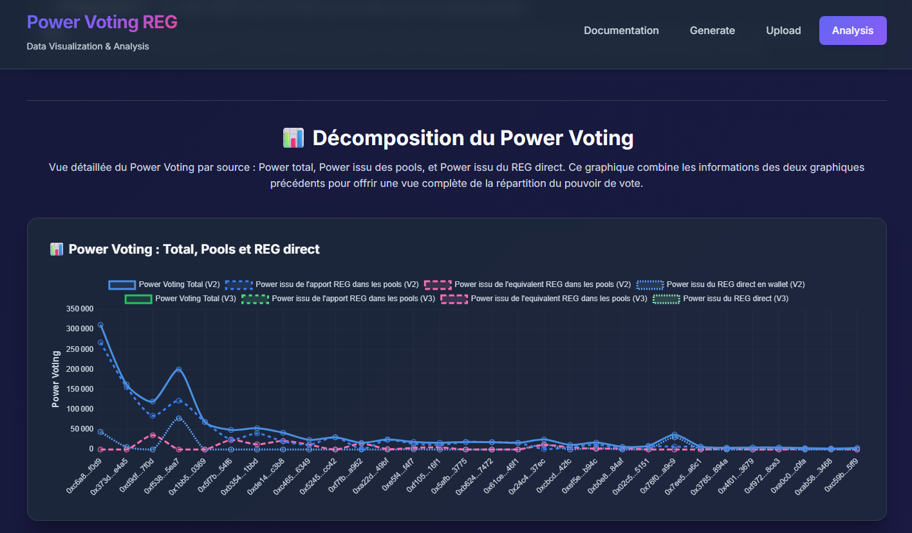

# 📊 Power Voting REG – Data Visualization Interface

Lightweight dashboard to upload REG balances and voting-power exports, run instant stats, and spot how liquidity positions translate into voting weight.

## 📸 Demos

| Generation | Concentrate | History |
|------------|-------------|---------|
|  |  |  |

| Analysis – Pools (1) | Analysis – Pools (2) |
|---------------------|----------------------|
|  |  |

## 🚀 Key Features

- File uploads (CSV/JSON) for balances and power data
- Automatic stats: totals, medians, min/max, standard deviation
- Interactive charts (distribution, pool vs power correlation)
- Top holders lists for balances and voting power
- Mock data loader for quick demos
- Dark UI with modern gradients and glass effects

## 🚀 Running

```
make dev-build
make dev-run
```

## 📁 Data Model

### Balances REG

```json
{
  "result": {
    "balances": [
      {
        "walletAddress": "0x...",
        "type": "wallet",
        "totalBalanceREG": "100",
        "totalBalanceEquivalentREG": "0"
      }
    ]
  }
}
```

### Power Voting REG

```json
{
  "result": {
    "powerVoting": [
      {
        "address": "0x...",
        "powerVoting": "100"
      }
    ]
  }
}
```

## 🛠 Tech Stack

- Vue 3 + TypeScript + Vite
- Pinia + Vue Router
- Chart.js + vue-chartjs
- PapaParse for CSV parsing

## ⚙️ Getting Started

```bash
# install dependencies
npm install

# start dev server
npm run dev

# production build
npm run build

# preview build
npm run preview

# tests
npm run test
```

## 🎯 How to Use

1. Home page: upload your `balancesREG` and `powerVotingREG` files (CSV/JSON) or load the mock data.
2. Analysis page: explore the computed stats, top lists, pool vs power correlation chart, and detailed tables.

### Sample Files

Click “Use sample data” to load the JSON fixtures stored in `/mock/`.

## 📊 Metrics & Visuals

- Totals, averages, medians, min/max, standard deviation
- Distribution buckets for balances and voting power
- Pool V2/V3 liquidity split, DEX allocation, correlation charts
- Boost view (power per REG vs 1:1 reference line)

## 🧱 Project Structure

```
src/
├── views/              # Upload + Analysis screens
├── stores/             # Pinia store
├── router/             # Routing
├── App.vue             # Root component
└── main.ts             # Entry point

mock/
├── balancesREG_*.json
└── powerVotingREG_*.json
```

## 🌐 Deployment

```bash
npm run build
```

Optimized assets are generated in `dist/`.

## 📄 License

RealT Project – 2025

## 🤝 Contributing

1. Fork the repo  
2. Create a feature branch `git checkout -b feature/my-feature`  
3. Commit `git commit -m "Add my feature"`  
4. Push `git push origin feature/my-feature`  
5. Open a Pull Request  
